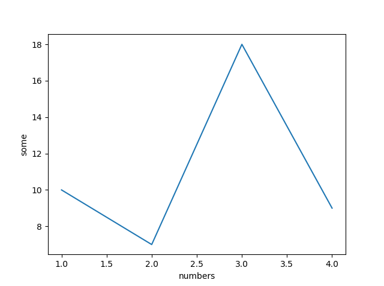
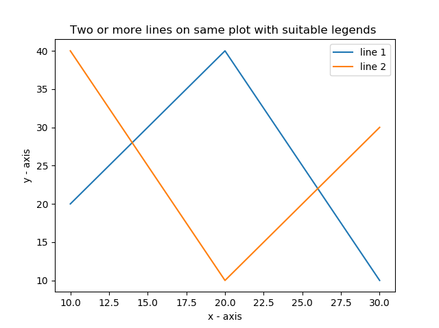

# Exam

## Whirlwind, Lists, Loops, Cond. Stmts., Functions, Modules, Dicts

### What is the difference between a list and a dictionary?

A `list` is an ordered sequence of elements. The elements can have any type, and the elements don’t have to be of the same type.

A `dictionary` is an unordered set of key-value pairs. The keys can have any hashable type, while the values don’t have any type restrictions.

The elements of a list can be accessed by their index, whereas the values of a dictionary is accessed by their key.

**Working with Lists**

```python
# Creating a List
cats = ['Blacki', 'Snappy', 'Kitty', 'Jessie', 'Chester']

# Extracting items from the list
print cats[0:2]

# Adding items to the list
cats.append('Catherine')

# Removing items from the list
del cats[1]
```

**Working with Dicts**

```python
# Creating a Dictionary
phonebook = {'Andrew Parson': 8806336,
             'Emily Everett': 6784346, 'Peter Power': 7658344,
             'Lewis Lame': 1122345}

# Adding entries to the dict
phonebook['Scott Hanes'] = 20224029

# Remvoing entries from the dict
del phonebook['Andrew Parson']
```

ref: http://sthurlow.com/python/lesson06/

### How do you write a module in Python?

Python modules are `.py` files that consist of Python code. Any Python file can be referenced as a module.

Some modules are available through the [Python Standard Library](https://docs.python.org/3/library/), while others can be installed with Python’s package manager `pip`.

You can write your own module by creating a `.py` file. In this file you can write Python code like you would do in any Python script. To use this module in another Python script, you simply just import it and you will be able to use the variables, funtions, and classes you have made in the module with the `.` notation.

```python
# hello.py

# Define a function
def world():
    print("Hello, World!")

# Define a variable
shark = "Sammy"

# Define a class
class Octopus:
    def __init__(self, name, color):
        self.color = color
        self.name = name

    def tell_me_about_the_octopus(self):
        print("This octopus is " + self.color + ".")
        print(self.name + " is the octopus's name.")
```

```python
# main.py

# Import hello module
import hello

# Call function
hello.world()

# Print variable
print(hello.shark)

# Call class
jesse = hello.Octopus("Jesse", "orange")
jesse.tell_me_about_the_octopus()
```

_output:_

```
Hello, World!
Sammy
This octopus is orange.
Jesse is the octopus's name.
```

If you modue contains code that should only run when it is run as the main, you should encapsulate it:

```python
if __name__ == '__main__':
  #run code
```

ref: https://www.digitalocean.com/community/tutorials/how-to-write-modules-in-python-3

## Files, CLI, OO, Exceptions

### How do you open a file in Python?

```python
with open(filename,'w') as file:
  # do stuff with file
```

`with` makes sure the file gets closed when the script is done with the file. You can open the file without `with`, the you have to make sure to call `.close()` on the file.

| Mode | Description                                                                                                            |
| ---- | ---------------------------------------------------------------------------------------------------------------------- |
| 'r'  | This is the default mode. It Opens file for reading.                                                                   |
| 'w'  | This Mode Opens file for writing. If file does not exist, it creates a new file. If file exists it truncates the file. |
| 'x'  | Creates a new file. If file already exists, the operation fails.                                                       |
| 'a'  | Open file in append mode. If file does not exist, it creates a new file.                                               |
| 't'  | This is the default mode. It opens in text mode.                                                                       |
| 'b'  | This opens in binary mode.                                                                                             |
| '+'  | This will open a file for reading and writing (updating)                                                               |

ref: https://www.guru99.com/reading-and-writing-files-in-python.html

### How do you throw an exception in Python?

```python
x = 10
if x > 5:
    raise Exception('x should not exceed 5. The value of x was: {}'.format(x))
```


```python
import sys

def linux_interaction():
    assert ('linux' in sys.platform), "Function can only run on Linux systems."
    print('Doing something.')

try:
    linux_interaction()
except AssertionError as error:
    print(error)
else:
    try:
        with open('file.log') as file:
            read_data = file.read()
    except FileNotFoundError as fnf_error:
        print(fnf_error)
finally:
    print('Cleaning up, irrespective of any exceptions.')
```

In this example, everything in the finally clause will be executed. It does not matter if you encounter an exception somewhere in the try or else clauses. Running this on a Windows machine would output the following:

```
Function can only run on Linux systems.
Cleaning up, irrespective of any exceptions.
```

ref: https://realpython.com/python-exceptions/

## Intro to Plotting

### How do you plot a line chart in Matplotlib?

```python
import matplotlib.pyplot as plt
plt.plot([1, 2, 3, 4], [10, 7, 18, 9])
plt.ylabel('some')
plt.xlabel('numbers')
plt.show()
```



### What is an axis in a Matplotlib plot?


[matplotlib.axis](https://matplotlib.org/api/_as_gen/matplotlib.pyplot.axis.html) docs

## Intro to Numpy and Plotting Cntd

### What does it mean that an array has a shape?

The shape property is usually used to get the current shape of an array, but may also be used to reshape the array in-place by assigning a tuple of array dimensions to it.

```python
data = [1, 2, 3]
x = np.array(data)
x.shape
```

has shape (4,)

```python
data = [[1, 2, 3], [4, 5, 6]]
x = np.array(data)
x.shape
```

has shape (2, 3)

```python
data = [[[1, 2, 3], [4, 5, 6]], [[7, 8, 9], [10, 11, 12]]]
x = np.array(data)
x.shape
```

has shape (2, 2, 3)

ref: https://docs.scipy.org/doc/numpy/reference/generated/numpy.ndarray.shape.html

### How do you plot multiple lines in Matplotlib?

```python
import matplotlib.pyplot as plt
# Line 1 points
x1 = [10, 20, 30]
y1 = [20, 40, 10]

# Plotting the line 1 points
plt.plot(x1, y1, label="line 1")

# Line 2 points
x2 = [10, 20, 30]
y2 = [40, 10, 30]

# Plotting the line 2 points
plt.plot(x2, y2, label="line 2")

# Setting the axis-labels
plt.xlabel('x - axis')
plt.ylabel('y - axis')

# Set a title of the current axes.
plt.title('Two or more lines on same plot with suitable legends ')

# show a legend on the plot
plt.legend()

# Display a figure.
plt.show()
```



## Intro to Pandas

### What is a `DataFrame`?

A DataFrame is a two-dimensional data structure - dat athat is aligned in a tabular fashion in rows and columns

**Features of a DataFrame**

-   Potentially columns are of different types
-   Size – Mutable
-   Labeled axes (rows and columns)
-   Can Perform Arithmetic operations on rows and columns

**DataFrames can be created from various inputs:**

-   Lists
-   Dicts
-   Series
-   Numpy ndarrays
-   Another DataFrame

**Creating a DataFrame from Lists**

```python
import pandas as pd
data = [['Alex',20],['Bob',24],['Clarke',23], ['Sam', 22]]
df = pd.DataFrame(data,columns=['Name','Age'])
print(df)
```

**Creating a DataFrame from Dict of ndarrays / Lists**

It's important to note that all of the ndarrays has to be the same length - If index is passed, then the length of the index should be equal to the length of the arrays.

```python
import pandas as pd
data = {'Name':['Tom', 'Jack', 'Steve', 'Ricky'],'Age':[28,34,29,42]}
df = pd.DataFrame(data)
print df
```

```python
import pandas as pd
data = {'Name':['Tom', 'Jack', 'Steve', 'Ricky'],'Age':[28,34,29,42]}
df = pd.DataFrame(data, index=['rank1','rank2','rank3','rank4'])
print df
```

The difference between these two exampls is the index - the first will have the standard 0, 1, 2, 3... and the secound will have the required string from index.

**Creating a DataFrame from List of Dicts**

The dicts keys are by default taken as column names.

```python
import pandas as pd
data = [{'a': 1, 'b': 2},{'a': 5, 'b': 10, 'c': 20}]
df = pd.DataFrame(data)
print df
```

This below example shows how you can make a DataFrame from a list of dicts, row indices and column indices.

```python
import pandas as pd
data = [{'a': 1, 'b': 2},{'a': 5, 'b': 10, 'c': 20}]

#With two column indices, values same as dictionary keys
df1 = pd.DataFrame(data, index=['first', 'second'], columns=['a', 'b'])

#With two column indices with one index with other name
df2 = pd.DataFrame(data, index=['first', 'second'], columns=['a', 'b1'])
print df1
print df2
```

ref: https://www.tutorialspoint.com/python_pandas/python_pandas_dataframe.htm

### How do you access a row in a `DataFrame`?

Let's start by getting some data

```python
import pandas as pd
df1 = pd.read_csv("https://pythonhow.com/data/income_data.csv")
```

You can try and print out the DataFrame in both Jupyter Notebook and in a terminal - It will be more visual pleasing in Jupyter.

Before extracting data from the dataframe, it would be a good practice to assign a column with unique values as the index of the dataframe. The State column would be a good choice.

**Assigning an index column to pandas dataframe**

```python
df2 = df1.set_index("State", drop = False)
```

**_Note:_** _As you see you needed to store the result in a new dataframe because this is not an in-place operation. Also note that you should set the `drop` argument to False. If you don’t do that the `State` column will be deleted so if you set another index later you would lose the `State` column._

The `df2` DataFrame will now have the states as index instead of the auto-generated 0,1,2,3...

**Extracting a subset of a pandas dataframe**

Difference between iloc and loc:

-   .loc for label based indexing
-   .iloc for positional indexing

Here is the general syntax rule to subset portions of a dataframe

```python
df.loc[startrow:endrow, startcolumn:endcolumn]
```

This is how it will look with out data - Here we extract the values for the rows from Alaska through Arkansas for years 2005 to 2007

```python
df2.loc["Alaska":"Arkansas","2005":"2007"]
```

**Extracting a column of a pandas dataframe**

Here we'll extract the values from all the states in 2005

```python
df2.loc[: , "2005"]
```

**Extracting a row of a pandas dataframe**

Here we'll extract all the values from California.

```python
df2.loc["California", : ]
```

**Extracting specific columns of a pandas dataframe**

```python
df2[["2005", "2008", "2009"]]
```

This would only show columns 2005, 2008, and 2009 with all their rows.

**Extracting specific rows of a pandas dataframe**

```python
df2[1:3]
```

This would return the row with index 1, and 2. The row with index 3 is not included in the extract because that’s how the slicing syntax works.

**Extracting a single cell from a pandas dataframe**

```python
df2.loc["California","2013"]
```

You can also apply methods to the subset

```python
df2.loc[:,"2005"].mean()
```

This will return the mean _(average)_ value from the year 2005 for all states in the DataFrame.

**Position based indexing**

In case you don't have row or column labels, you'll to rely on position based indexing, which is where we use `.iloc` instead of `.loc`.

```python
df2.iloc[0:3,0:4]
```

ref: https://pythonhow.com/data-analysis-with-python-pandas

## Multiprocessing, generators and intro to Requests

### What is the difference between an iterator and a generator?

### How do you parallelise programs in Python?

## Graphs & PageRank

### What is a graph?

### Why does the PageRank algorithm exist?

## Webscraping Basics, Regular Expr. & Selenium

### What is a regular expression?

### What is Selenium?

## Feature spaces

### What is a feature?

### What is a feature vector?

## Neural Networks

### What is a neuron?

### What is an activation function?

## Image Proc. (OpenCV)

### How do you represent an image in a Numpy array?

### What is a colour space?

## Movement Detection

### What is an `object`?

### How does movement detection work?
